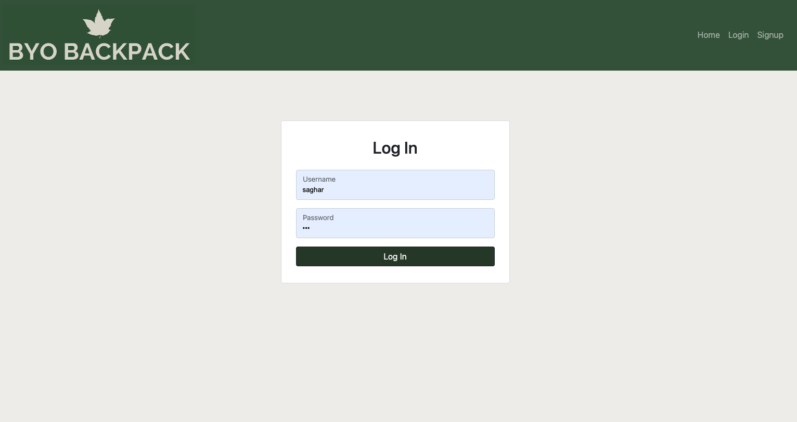
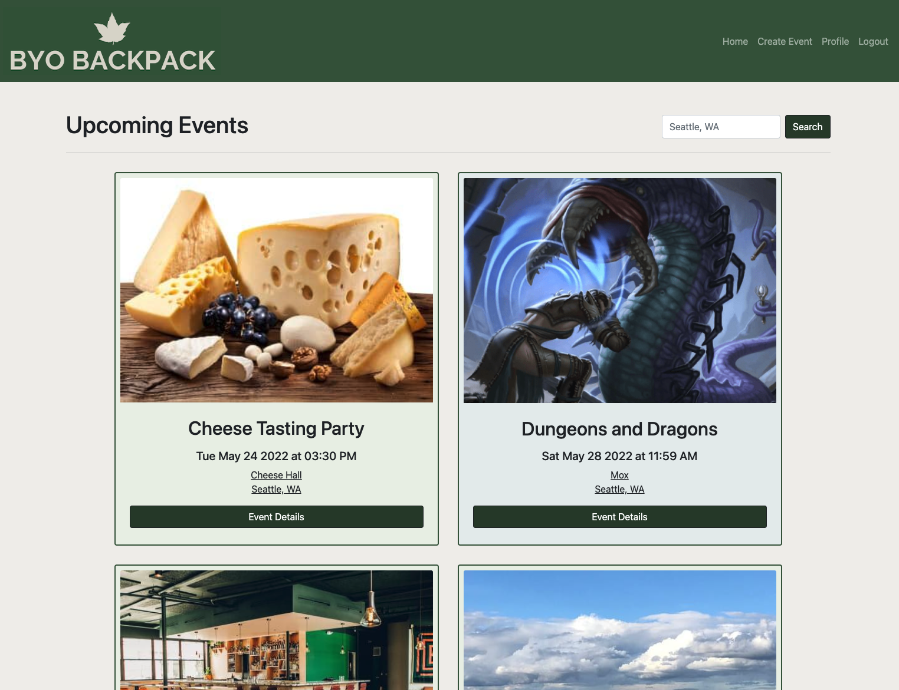
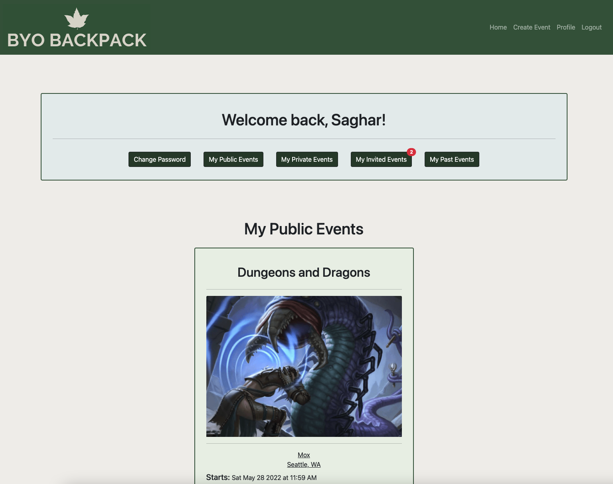
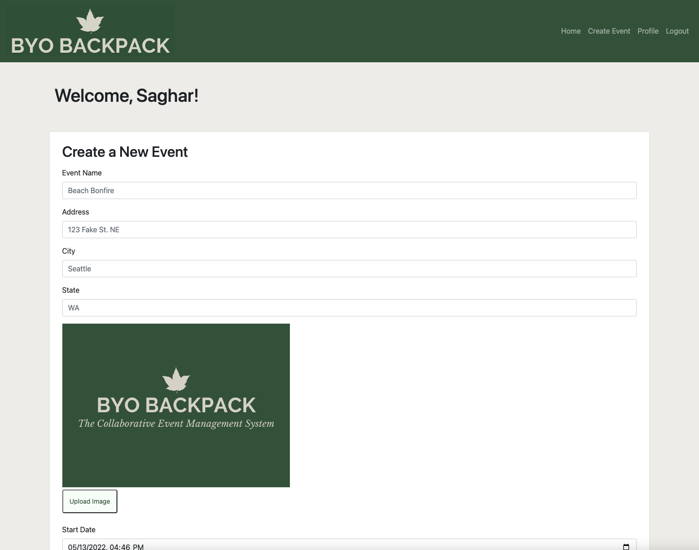
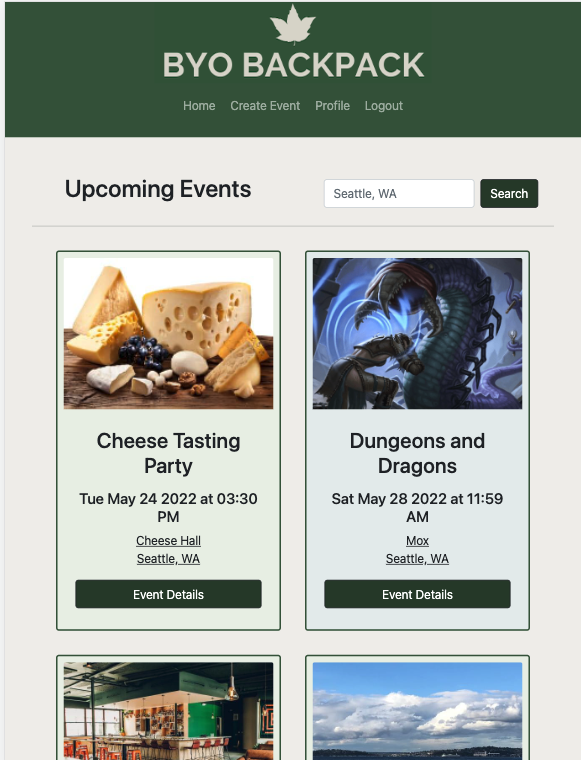
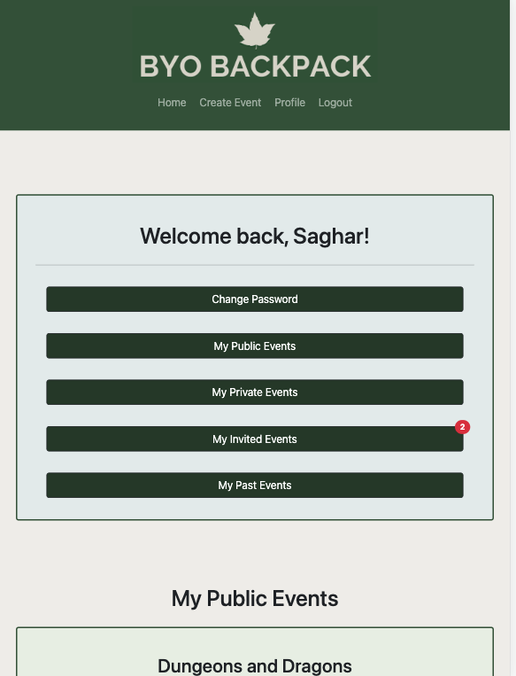
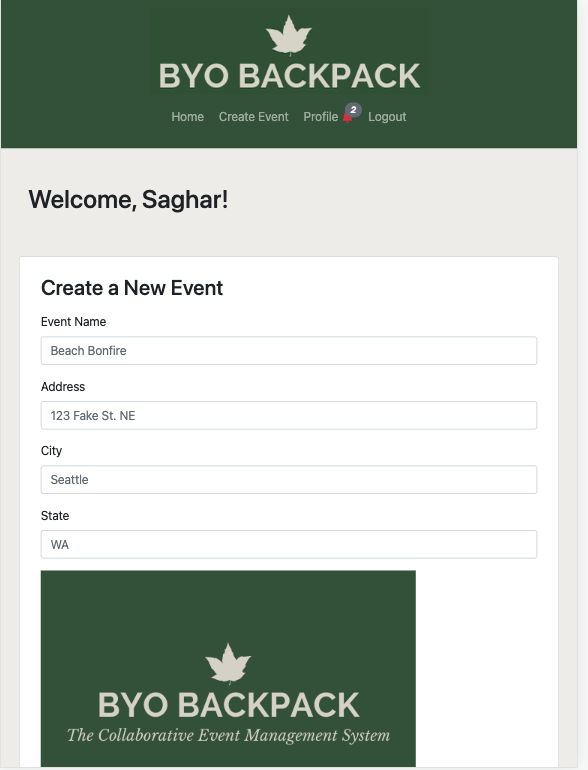
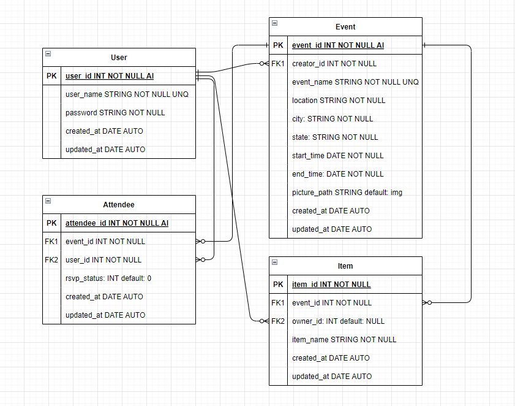

# byo-backpack
  

## Contribute
*   Lola Applegate
*   Chuan Wang
*   Jeff Hicks
*   Saghar Behinaein
  
## User Story
AS a user, 
I WANT an application that lets me post events, RSVP to others, invite others and sign up to bring supplies,
SO THAT I can connect with my community, meet new people, and try new things.

## Deployed link
[Deployed Link](https://byo-backpack.herokuapp.com/)
    
## Table of Contents 
    
  - [Contribute](#contribute)
  - [User Story](#user-story)
  - [Deployed link](#deployed-link)
  - [Table of Contents](#table-of-contents)
  - [Installation](#installation)
  - [Consept](#concept)
  - [Test](#test)
  - [ERD](#erd)

## Installation
Here are some guidelines to help you get started:

1. Clone the project in your laptop  
2. Make sure you installed Node on your visual studio 
3. Run the `npm install` comand in your terminal
4.  inside it should have:
    * DB_USER=root
    * DB_PASSWORD= what ever your password is for root user
    * DB_NAME= byo_backpac_db
    * SESSION_SECRET = super secret 
5.  start the terminal from index.js
6.  run the `npm run resetdb` in terminal
7.  run the `npm run seeds` in terminal
8.  run the `npm start` in terminal

Or just go to deployed site, no need for install   

## Concept
A Collaborative Event Management System
* Create an account & login
* Create new events
* Update events
* Invite other users to your events
* See events created by other users
* RSVP & sign up to bring items
* Search for events in your city

## Test
 
you can see diffrent pages in the Byo-Backpack:   
* Login Page: 

* Home Page: 

* Profile Page: 

* Create an Event Page: 

* Home Page for mobile: 

* profile Page for mobile: 

* Create an Event Page for mobile: 

## ERD

